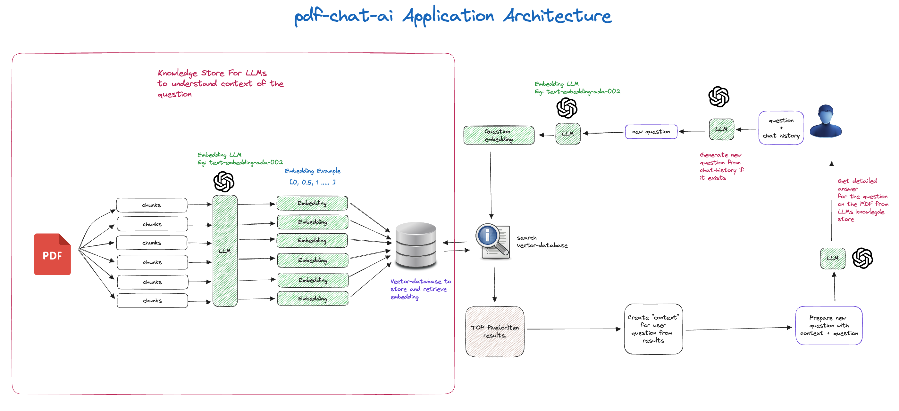

## ✨ What we provide ✨
🚀 Revolutionize tech learning with conversation! Say farewell to static docs—our AI-powered platform guides you through tech info effortlessly. 💬 Join the conversation now!

## 👷🏾‍♂️ Architecture 

## 👩‍🚀 Description

Built with:
- ✅ Next.js 14
- ✅ Shadcn-ui
- ✅ Langchain integration
- ✅ MongoDB as the knowledge store
- ✅ Prisma as the database ORM

## 🗃️ ENV Variables

Here are the environment variables required to run this project:

- **NEXTAUTH_URL**: The URL of your Next.js application.
- **NEXTAUTH_SECRET**: Secret used for session encryption in NextAuth.js.
- **GOOGLE_CLIENT_ID**: Client ID for Google OAuth authentication.
- **GOOGLE_CLIENT_SECRET**: Client secret for Google OAuth authentication.
- **GITHUB_APP_CLIENT_ID**: Client ID for GitHub OAuth authentication.
- **GITHUB_APP_CLIENT_SECRET**: Client secret for GitHub OAuth authentication.
- **DB_URL**: URL for connecting to your MongoDB database. (Starts with `mongodb+srv://`)
- **DATABASE_URL**: Prisma database connection URL. (Starts with `prisma://`) - Note: `DATABASE_URL` is the Prisma accelerate connection URL.
- **OPENAI_API_KEY**: API key for accessing OpenAI services.

## 🧞 Commands

All commands are run from the root of the project, from a terminal:

| Command        | Action                                          |
| :------------- | :---------------------------------------------- |
| `pnpm install` | Installs dependencies                           |
| `npm run dev`  | Starts the local dev server at `localhost:3000` |

## 👏🏽 Contributing

Pull requests are welcome, before creating a PR talk to me on [gmail](mailto:niikkhilsharma@gmail.com). For major changes, please open an issue first
to discuss what you would like to change.